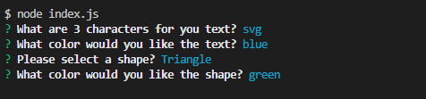

# OOP-SVG-Challenge-10

My challenge 10 OOP SVG logo maker for the bootcamp class.

I made a interactive svg logo generator.

## [Link to video](https://drive.google.com/file/d/1gC21y-4o4qeURa-tgcrJBFs_7mDrSKDk/view)

